# Architecture Guide -- jana-bfi-demo

**Last updated:** 2026-08-27

This document describes the architecture of the BFI (Bank Financed-emissions
Intelligence) application. It is written for Jana engineers onboarding onto or
maintaining the codebase.

---

## What this application is

A Next.js 15 application that Nepali commercial banks deploy on their internal
infrastructure to manage environmental and social risk across their loan
portfolios. It covers five regulatory frameworks:

| Framework | Module | Purpose |
|-----------|--------|---------|
| NRB ESRM 2022 | ESDD | Environmental & Social Due Diligence checklists |
| NRB Green Finance Taxonomy 2024 | Taxonomy | Loan classification (green/amber/red) |
| PCAF Global Standard | PCAF | Financed-emissions data quality scoring |
| IFC Performance Standards | PF Screening | Project Finance safeguard screening |
| NRB ESRM Annex 8-10 | CAP / Monitoring | Corrective Action Plans and periodic monitoring |

The application supports **two modes in a single build**:

- **Demo mode** -- fabricated 80K-loan portfolio, synthetic emissions, invented
  officers. Used for sales presentations, bank training sessions, and conference
  demos.
- **Live mode** -- empty loan book, real officer captures persisted to Supabase,
  real Climate TRACE emissions data. Used for actual bank operations.

A bank user can switch between modes at runtime (e.g. for training) via the Demo
menu. The two modes share the same UI, the same regulatory logic, and the same
database -- but every captured row is tagged with its origin (`'demo'` or
`'live'`), and queries are scoped so they never mix.

---

## High-level architecture

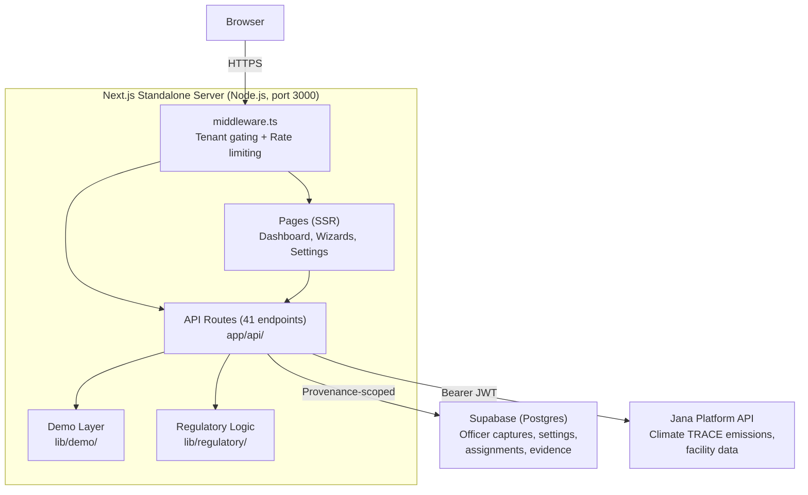

### Offline variant (air-gapped demos)

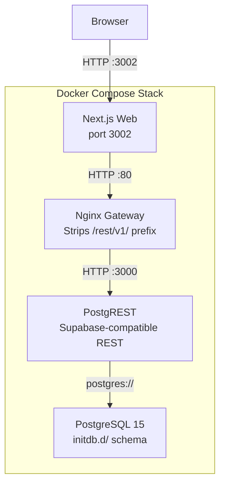

The offline stack replaces Supabase Cloud with a local Postgres + PostgREST
pair. The existing `@supabase/supabase-js` client works unchanged because the
Nginx gateway presents the same REST shape. No external network required.

---

## Directory structure

```
jana-bfi-demo/
+-- app/                          Next.js App Router
|   +-- api/                      41 API endpoints (grouped below)
|   +-- esdd/[loanId]/            ESDD wizard page
|   +-- pf-screening/[loanId]/    PF screening wizard page
|   +-- pcaf/[loanId]/            PCAF wizard page
|   +-- taxonomy/[loanId]/        Taxonomy wizard page
|   +-- cap/[loanId]/             CAP wizard page
|   +-- enter/                    Bank access-code entry
|   +-- settings/                 Tenant settings
|   +-- admin/reset/              Demo admin (reset seeded data)
|   +-- layout.tsx                Root layout (theme, tour context)
|   +-- page.tsx                  Dashboard (SSR)
|
+-- components/bfi/               React components
|   +-- tabs/                     Dashboard tabs (loans, esrm, taxonomy, nfrs, my-work)
|   +-- demo/                     Demo menu, demo banner
|   +-- tour/                     Tour overlay, controls, shell
|   +-- shared/                   Loan table, facility map, evidence attachments
|   +-- esdd/                     ESDD wizard
|   +-- pcaf/                     PCAF wizard, availability panel, evidence section
|   +-- taxonomy/                 Taxonomy wizard, gate screen
|   +-- cap/                      CAP wizard, CAP panel
|   +-- pf-screening/             PF screening wizard
|   +-- hydro/                    Hydropower doc matrix
|   +-- esrm/                     Officer work queue, climate risk panel
|   +-- followups/                Follow-up task list
|   +-- settings/                 Settings page
|   +-- reports/                  Export buttons (NRB taxonomy, NRBSIS)
|
+-- lib/                          Server & shared logic
|   +-- demo/                     THE DEMO LAYER (see below)
|   +-- data/                     Supabase client, capture client, queries
|   +-- api/                      HTTP client, route helpers, rate limiter
|   +-- regulatory/               Pure regulatory logic (5 domains)
|   +-- tenants/                  Tenant registry, resolution, types
|   +-- officers/                 Officer resolution, loan locking
|   +-- tour/                     Tour registry, types, state machine
|   +-- auth/                     Device-code auth context
|   +-- settings/                 Settings schema, defaults
|   +-- reports/                  Report formatters (NRB, NRBSIS)
|   +-- reporting/                Reporting period helpers
|   +-- types/                    Core domain types (Loan, Borrower, etc.)
|   +-- constants.ts              Centralised constants
|   +-- units.ts                  Currency conversion (NPR/USD)
|
+-- scripts/                      Build guards + utilities
|   +-- check-*.mjs / .ts         11 build-time guard scripts
|   +-- precompute-portfolio.ts   Generates precomputed-portfolio.json.gz
|   +-- supabase-*.sql            Migration SQL for Supabase Cloud
|
+-- docker/                       Docker support files
|   +-- nginx/                    Supabase gateway config (offline mode)
|   +-- postgres/initdb.d/        Schema SQL (offline mode, runs on first boot)
|
+-- data/tour-scripts/            Tour narration scripts (JSON per tenant)
+-- docs/                         User manuals, regulatory sources
+-- public/                       Static assets (logos, audio)
```

---

## The demo/live boundary

This is the most important architectural decision in the codebase. The
application is a single build artifact that contains both a training mode
(fabricated data) and a production mode (real data). The boundary between them
is enforced at three levels.

### Level 1: Build-time gate (`JANA_DEMO` environment variable)

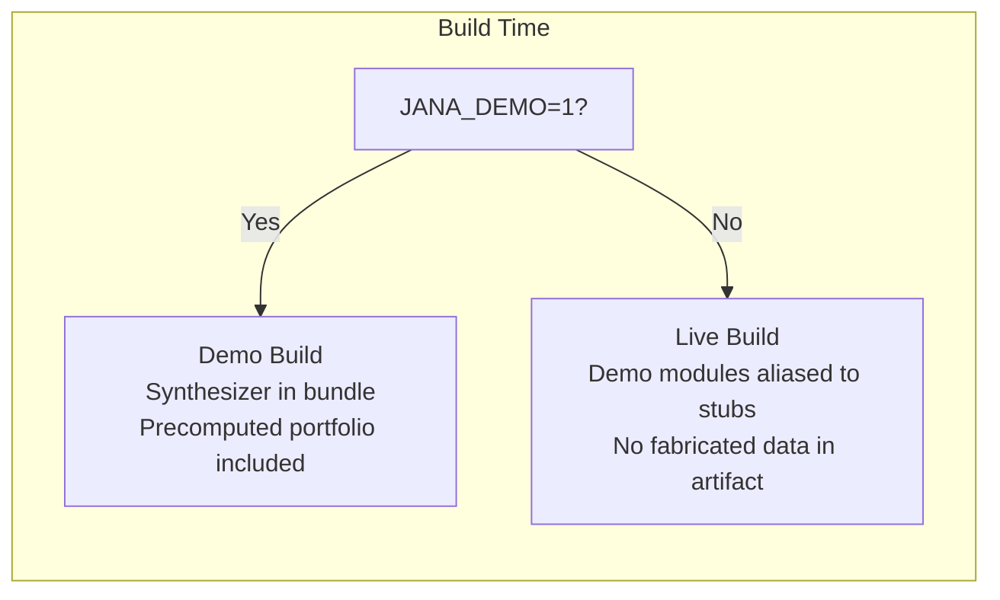

- `next.config.ts` reads `JANA_DEMO` and aliases `lib/demo/*` to empty stubs
  when unset. The bundler's dead-code elimination removes all demo code.
- `isDemoBuild()` in `lib/demo/provider.ts` reads `process.env.JANA_DEMO` at
  runtime and returns a boolean. This is the single source of truth for "does
  this image contain the demo layer."
- The precomputed portfolio (2.7 MB gzipped, 80K loans) is only included in the
  standalone output when `JANA_DEMO=1`.

### Level 2: Runtime toggle (cookie)

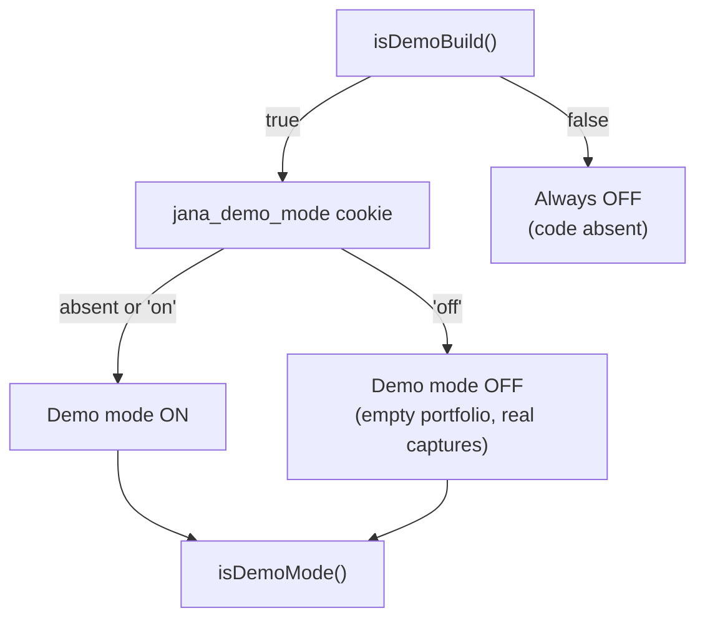

- `isDemoMode()` in `lib/demo/mode.ts` combines both signals:
  `isDemoBuild() && (cookie !== "off")`.
- The toggle is **asymmetric by design**: the cookie can only narrow what's
  shown (demo on -> off), never widen (off -> on in a live build). Misuse
  produces silence, not a data leak.
- `POST /api/demo/mode` sets the cookie. The Demo menu in the header exposes
  this toggle.

### Level 3: Data provenance (`origin` column)

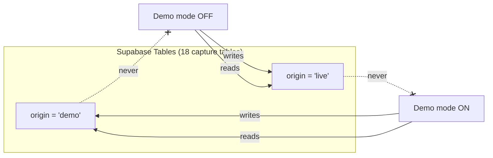

- Every capture table (assignments, ESDD responses, PCAF evidence, etc.) has an
  `origin` column with a `CHECK (origin IN ('demo', 'live'))` constraint.
- `lib/data/capture-client.ts` exports a `withOrigin()` proxy that intercepts
  all Supabase operations:
  - **Reads** (select, update, delete): appends `.eq("origin", currentOrigin)`
  - **Writes** (insert, upsert): injects `origin: currentOrigin` into the
    payload
- This is enforced at the client layer, not RLS, because the same Supabase
  project serves both modes.

### Build-time guard scripts

Eleven scripts run in `npm run prebuild` (before `next build`). Each catches one
category of boundary violation:

| Script | Guards against |
|--------|---------------|
| `check-demo-boundary.ts` | PCAF name fixtures leaking into live builds |
| `check-live-build-empty.ts` | Live build producing non-zero loan count |
| `check-build-wiring.mjs` | Demo provider import chain broken |
| `check-capture-client.mjs` | Capture-table access bypassing provenance proxy |
| `check-demo-imports.mjs` | Code outside `lib/demo/` importing from `lib/demo/` directly |
| `check-demo-mode-gate.mjs` | Demo provider accessed without `isDemoMode()` check |
| `check-demo-officers.mjs` | Fabricated officer fixtures used outside seeders |
| `check-docker-demo-flag.mjs` | `JANA_DEMO` mismatch between Dockerfile and compose files |
| `check-dockerignore-build-scripts.mjs` | Build scripts excluded from Docker image |
| `check-seeded-rows.mjs` | Seeded row counts don't match expectations |
| `check-pcaf-overlay.ts` | PCAF officer overlay produces correct scores |

Each script exits non-zero on failure, halting the build. The belt-and-suspenders
approach means a single guard failure does not silently compromise the boundary.

---

## Data flow

### Portfolio data (read path)

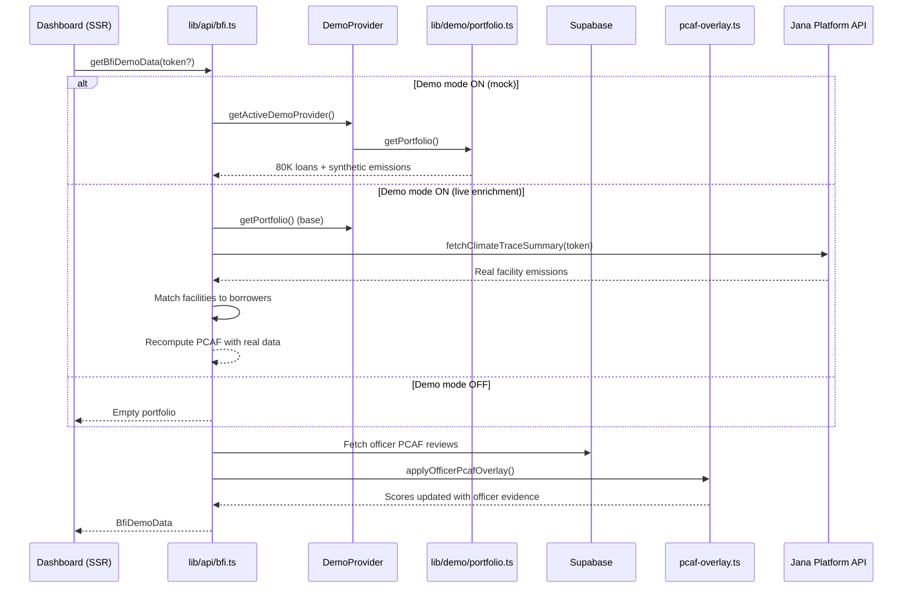

### Capture data (write path)

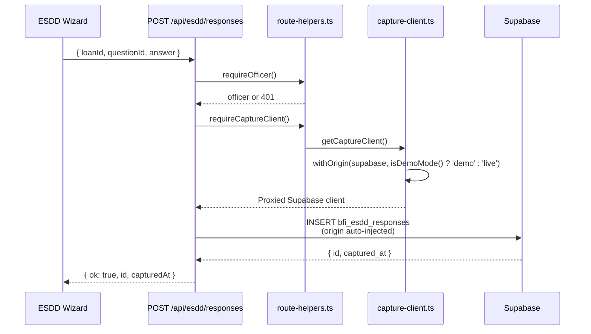

Every write goes through `requireCaptureClient()` which returns a
provenance-scoped Supabase proxy. The `origin` value is injected automatically
-- route handlers never set it manually.

---

## Multi-tenant system

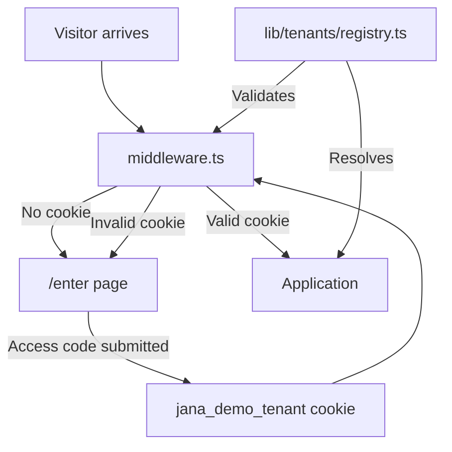

### Tenant registry

Two tenants are defined in `lib/tenants/registry.ts`:

| Tenant ID | Display Name | Access Code | Officers |
|-----------|-------------|-------------|----------|
| `default` | First Bank of Nepal | (none -- default fallback) | 4 demo officers |
| `laxmi_sunrise` | Laxmi Sunrise Bank | `LX-K7QN2P` | 4 demo officers |

Each tenant has:
- Branding (colors, logo, display name)
- Access codes (rotatable, validated at `/enter`)
- Demo officer roster (only visible in demo mode)
- Tour scripts (per-tenant narration)

### Adding a new tenant

1. Add entry to `lib/tenants/registry.ts`
2. Drop logo under `public/tenants/<id>/`
3. Add tour script JSONs to `data/tour-scripts/<id>/`
4. Import tour scripts in `lib/tour/registry.ts`

All Supabase queries are scoped by `bank_id = tenant.id`, so tenant data
isolation is automatic.

---

## Officer system

Officers are the users who perform regulatory assessments. In demo mode, they
are hardcoded fixtures from the tenant registry. In live mode, the roster is
empty (real officer provisioning is a future integration point).

### Loan ownership (first-toucher-owns)

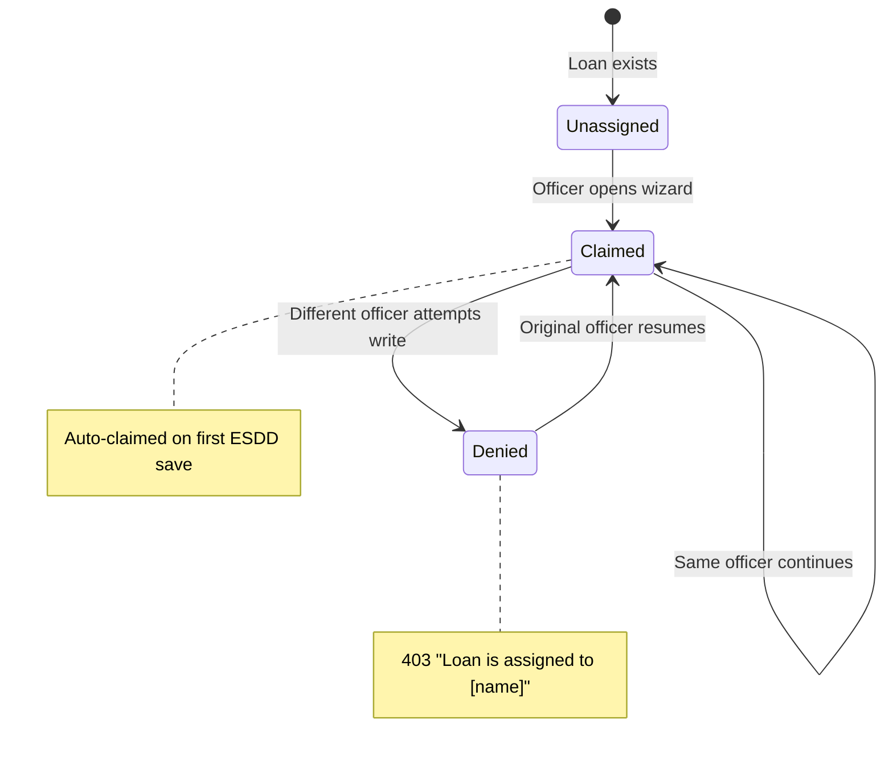

- `lib/officers/loan-lock.ts` implements the first-toucher-owns model.
- When an officer opens a wizard for an unassigned loan, the loan is
  auto-claimed via upsert to `bfi_loan_assignments`.
- Subsequent mutations (`assertOwnerOrRespond()`) verify the caller is the
  owner.
- The Manager view can reassign loans via `POST /api/manager/assignments`.

---

## API route organisation

41 endpoints grouped by domain:

| Group | Routes | Auth | Purpose |
|-------|--------|------|---------|
| **Admin** (4) | `/api/admin/seed`, `reset`, `seed-officers`, `seed-demo-data` | `SEED_ADMIN_TOKEN` | Seed/reset demo data |
| **Portfolio** (4) | `/api/bfi-data`, `dashboard-data`, `portfolio/loans`, `portfolio/taxonomy-summary` | Tenant cookie | Portfolio reads + aggregations |
| **ESDD** (3) | `/api/esdd/responses`, `officer-queue` | Officer cookie | ESDD assessment capture + queue |
| **PCAF** (3) | `/api/pcaf/scores`, `availability/[borrowerId]`, `evidence/[loanId]` | Officer cookie | PCAF scoring + evidence |
| **PF Screening** (3) | `/api/pf-screening/responses`, `submit`, `loan/[loanId]` | Officer cookie | Project Finance screening |
| **Taxonomy** (1) | `/api/taxonomy/assessments` | Officer cookie | Taxonomy classification capture |
| **CAP** (1) | `/api/cap/[loanId]` | Officer cookie | Corrective Action Plan data |
| **Evidence** (3) | `/api/evidence`, `[id]`, `[id]/download` | Officer cookie | File upload/download |
| **Manager** (2) | `/api/manager/queue`, `assignments` | Officer cookie | Manager workbench |
| **Follow-ups** (1) | `/api/followups` | Officer cookie | Reminder queue |
| **Reports** (2) | `/api/reports/nrb-taxonomy`, `nrbsis-green-statement` | Tenant cookie | PDF/Excel export |
| **Loans** (1) | `/api/loans/[loanId]/category` | Officer cookie | Loan category override |
| **Climate** (1) | `/api/climate/borrower/[borrowerId]` | Tenant cookie | Climate risk data |
| **Hydro** (2) | `/api/hydro/docs`, `docs/[loanId]` | Officer cookie | Hydropower doc matrix |
| **Settings** (1) | `/api/settings` | Tenant cookie | Tenant settings |
| **Demo** (1) | `/api/demo/mode` | Tenant cookie | Toggle demo/live mode |
| **Tenant** (2) | `/api/tenant/set-code`, `clear` | None | Set/clear tenant cookie |
| **Officer** (1) | `/api/officer/set` | Tenant cookie | Set officer cookie |
| **Health** (1) | `/api/health` | None | Container health check |

### Shared route helpers (`lib/api/route-helpers.ts`)

All officer-requiring routes use shared helpers to eliminate boilerplate:

- `requireOfficer(action)` -- returns `[officer, null]` or `[null, 401 response]`
- `requireCaptureClient()` -- returns `[supabaseProxy, null]` or `[null, 503 response]`
- `requireAdminToken(request)` -- validates Bearer header or `?token=` query param
- `apiError(message, status)` -- consistent error response shape
- `parseJsonBody(request, maxBytes?)` -- parsed body or 400/413 response
- `validateFileMime(buffer, filename)` -- magic byte allowlist check

---

## Regulatory logic (`lib/regulatory/`)

All regulatory logic is in pure TypeScript modules with no side effects. These
modules define the questions, scoring rules, and classification trees that the
UI consumes. They do not import React, do not call APIs, and do not touch the
database.

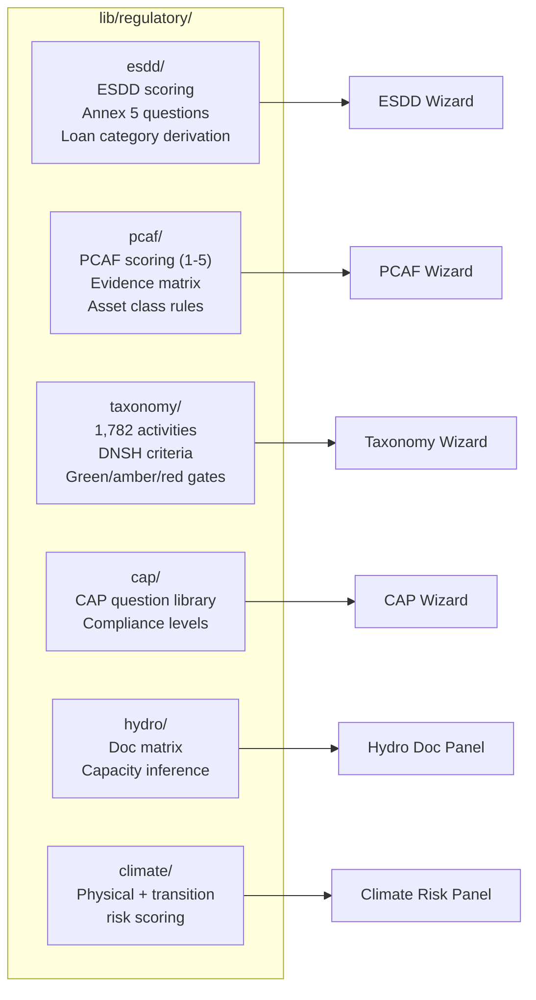

| Domain | Files | Lines | Key types |
|--------|-------|-------|-----------|
| ESDD | 6 | ~1,500 | `Annex5Question`, `EsddScore`, `LoanCategory` |
| PCAF | 3 | ~1,100 | `PcafScore` (1-5), `EvidenceTier`, `AssetClass` |
| Taxonomy | 5 | ~2,400 | `TaxonomyActivity`, `DnshCriterion`, `TaxonomyColor` |
| CAP | 2 | ~600 | `CapQuestion`, `ComplianceLevel` |
| Hydro | 2 | ~280 | `DocRequirement`, `CapacityClass` |
| Climate | 2 | ~380 | `ClimateRisk`, `PhysicalRisk`, `TransitionRisk` |

---

## Tour system

The application includes guided narrated tours for bank training sessions. Each
tour is a sequence of steps that spotlight UI elements, auto-navigate between
pages, and play audio narration.

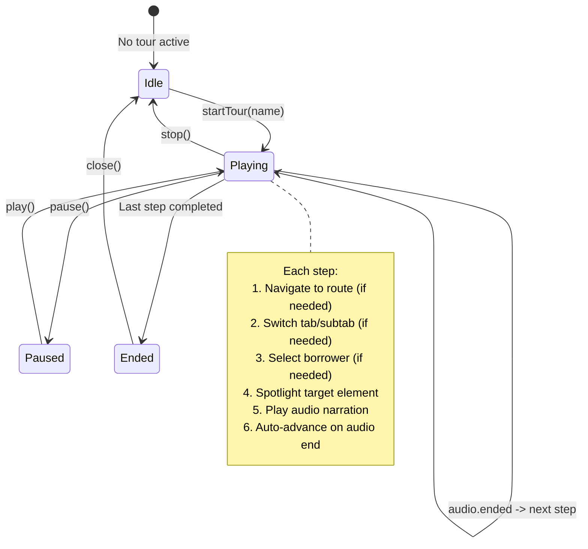

- **6 tours** per tenant: dashboard, loan-officer, manager, pf-screening, pcaf, nfrs
- **2 tenants** with per-tenant scripts and audio
- Tour scripts are JSON files in `data/tour-scripts/<tenant>/`
- Audio files are pre-generated MP3s in `public/audio/<tenant>/`
- State machine in `lib/tour/tour-context.tsx`
- Spotlight rendering in `components/bfi/tour/tour-overlay.tsx`

---

## Middleware

`middleware.ts` handles two concerns:

1. **Tenant gating (pages):** Visitors without a valid `jana_demo_tenant`
   cookie are redirected to `/enter`. Invalid cookie values are cleared.

2. **Rate limiting (API routes):** In-memory sliding-window limiter (100
   req/min per IP) for all `/api/*` routes except `/api/health`. **Demo builds
   are exempt** -- a bank demo room behind one NAT shares a single IP, and a
   single page load fires 6+ parallel API calls.

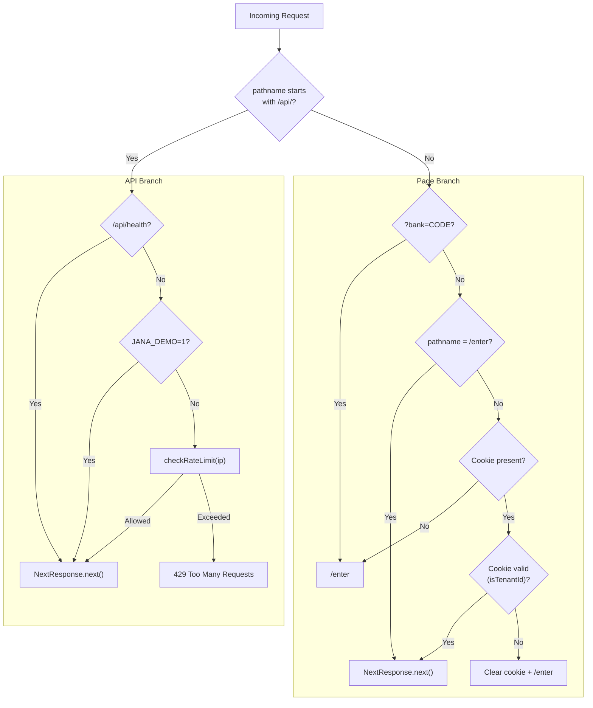

---

## Docker builds

### Build matrix

| Build arg | Demo image | Live image |
|-----------|-----------|------------|
| `JANA_DEMO` | `1` (default) | `0` |
| Bundle includes | Synthesizer, precomputed portfolio, demo menu | None of the above |
| `isDemoBuild()` returns | `true` | `false` |
| Officer roster | 4 per tenant | Empty |
| Portfolio on first load | 80K fabricated loans | Empty |

### Image structure

```
runner stage (node:20-alpine)
+-- server.js              Next.js standalone server
+-- .next/static/          Immutable-hashed JS/CSS bundles
+-- public/                Logos, audio (tour narration MP3s)
+-- (no node_modules)      Dependencies inlined by standalone output
```

- Non-root user (`nextjs:nodejs`, UID 1001)
- `HEALTHCHECK` via `wget -qO- http://localhost:3000/api/health`
- `HOSTNAME=0.0.0.0` pinned to avoid Docker container name resolution issues

### Compose files

| File | Purpose | Supabase | Network |
|------|---------|----------|---------|
| `docker-compose.yml` | Development / online demo | Cloud (via `.env.local`) | Internet required |
| `docker-compose.offline.yml` | Air-gapped demo | Local Postgres + PostgREST | No network needed |

The offline stack uses `docker/postgres/initdb.d/*.sql` for schema (runs on
first boot only). Schema changes require `docker compose down -v` to reset.

---

## Supabase schema (capture tables)

18 tables, all prefixed `bfi_`. Every table has:
- `bank_id` -- tenant isolation
- `origin` -- provenance (`'demo'` | `'live'`) with CHECK constraint
- Index on `(bank_id, origin)`

Key tables:

| Table | Purpose | Written by |
|-------|---------|-----------|
| `bfi_loan_assignments` | Loan ownership (first-toucher-owns) | Auto-claim on wizard open |
| `bfi_esdd_responses` | ESDD checklist answers (append-only) | ESDD wizard |
| `bfi_pcaf_availability` | PCAF score overrides from officer review | PCAF wizard |
| `bfi_pcaf_evidence_docs` | Evidence documents for PCAF scoring | Evidence upload |
| `bfi_pf_screening_responses` | PF screening answers | PF screening wizard |
| `bfi_taxonomy_assessments` | Taxonomy classification captures | Taxonomy wizard |
| `bfi_cap_items` | Corrective Action Plan items | CAP wizard |
| `bfi_monitoring_reports` | Periodic monitoring reports | Follow-up system |
| `bfi_tenant_settings` | Tenant-level configuration | Settings page |
| `bfi_evidence_metadata` | Evidence file metadata | Evidence upload |

Schema SQL lives in two places:
- `scripts/supabase-*.sql` -- applied to Supabase Cloud manually
- `docker/postgres/initdb.d/*.sql` -- auto-run in offline stack

These are not kept in sync by a migration system. The build-time guard
`check-capture-client.mjs` catches drift between app code and schema by
verifying that all table references in the codebase exist in the init scripts.

---

## Key design decisions

### Why in-memory portfolio, not database queries?

The 80K-loan portfolio is fabricated data that exists to make the demo feel
real. It is generated deterministically from a PRNG seed, so every build
produces the same portfolio. Storing it in Postgres would add ingestion
complexity with no benefit -- the demo never needs to scale past its current
data volume.

The `DemoProvider` pattern already supports a database-backed path: in a live
build, `getDemoProvider()` returns null, and routes fall through to Supabase
queries. If a bank ever pilots with real portfolio data, the data would live
in Supabase tables populated by an ingestion pipeline, bypassing the in-memory
path entirely.

### Why cookies for identity, not sessions?

Bank users select their tenant (via access code) and officer (via picker) at
the start of a session. These choices are stored in HTTP-only cookies. This is
intentional:

- No server-side session store to manage or expire
- Stateless server -- any replica can serve any request
- Cookies survive page refreshes and browser restarts
- Demo mode toggle is also a cookie (session-scoped, not persistent)

For production deployment on bank infrastructure, this would be replaced by
integration with the bank's SSO/LDAP system.

### Why append-only ESDD responses?

`bfi_esdd_responses` is an append-only table. Changing an answer inserts a new
row with a later `captured_at` timestamp. Readers take the latest per
`question_id`. This gives a free audit trail with no separate history table.

"Exit without saving" deletes only rows inserted after the wizard opened (the
`since` parameter), restoring the previous state without explicit restore logic.

### Why 11 build-time guards?

Each guard catches one specific failure mode. Belt-and-suspenders: if one guard
is accidentally disabled, the others still catch their respective violations.
The guards run in milliseconds and produce clear error messages identifying
exactly which invariant was violated.
