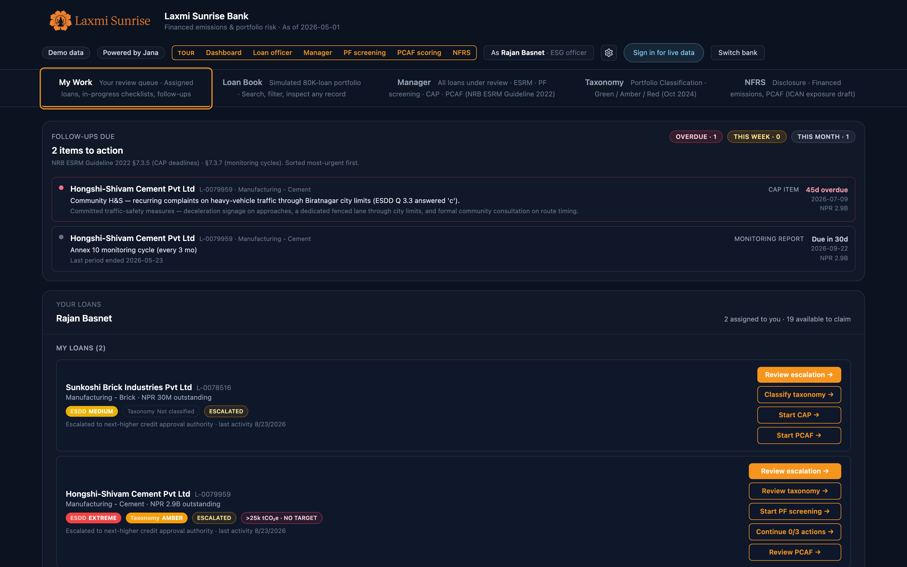
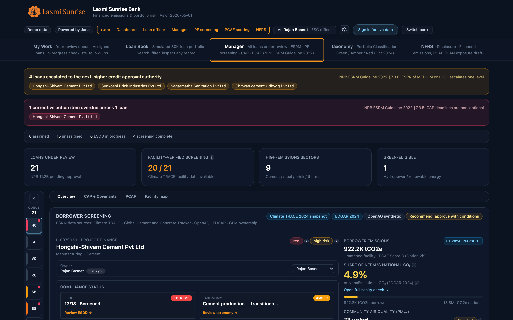
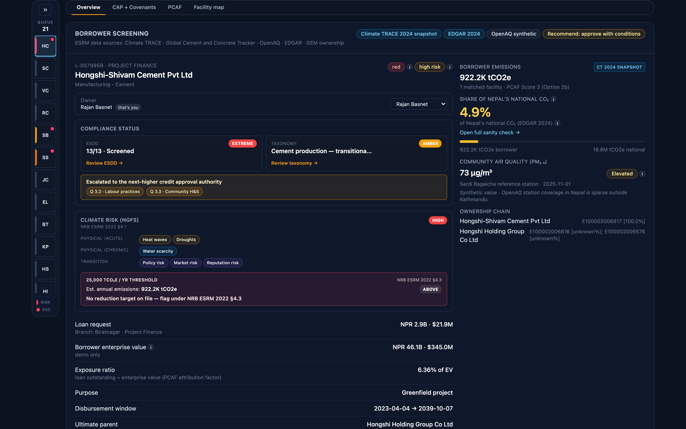
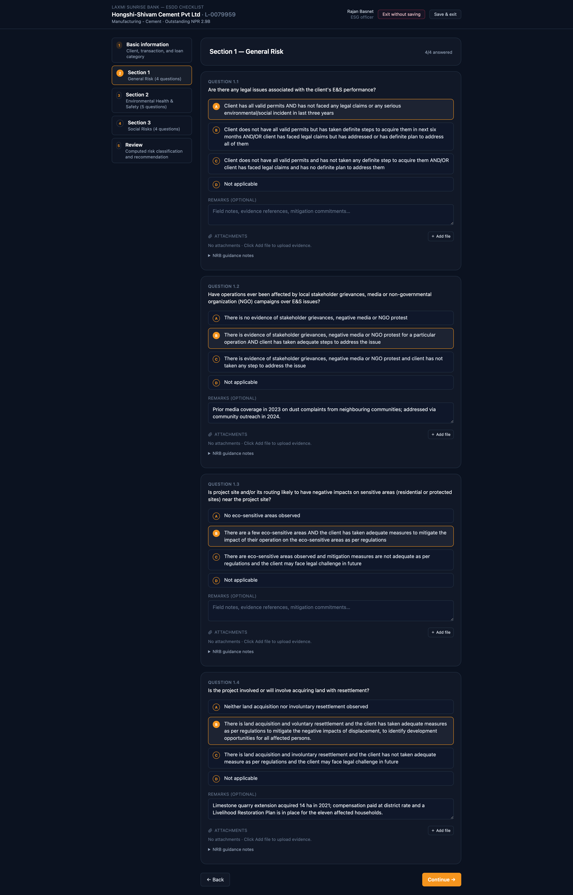
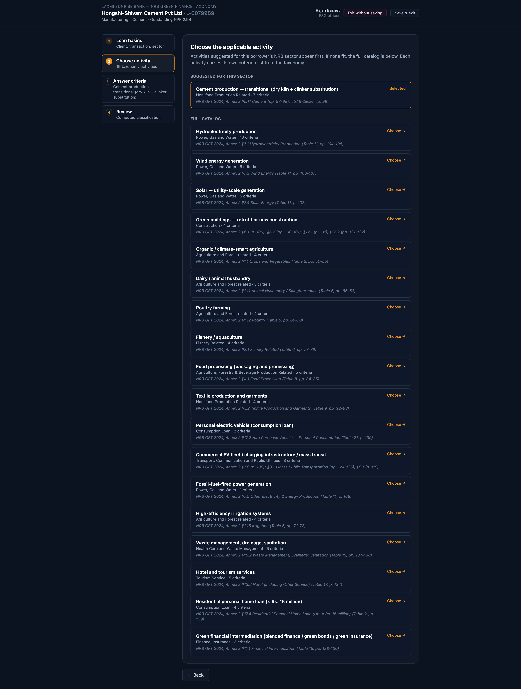
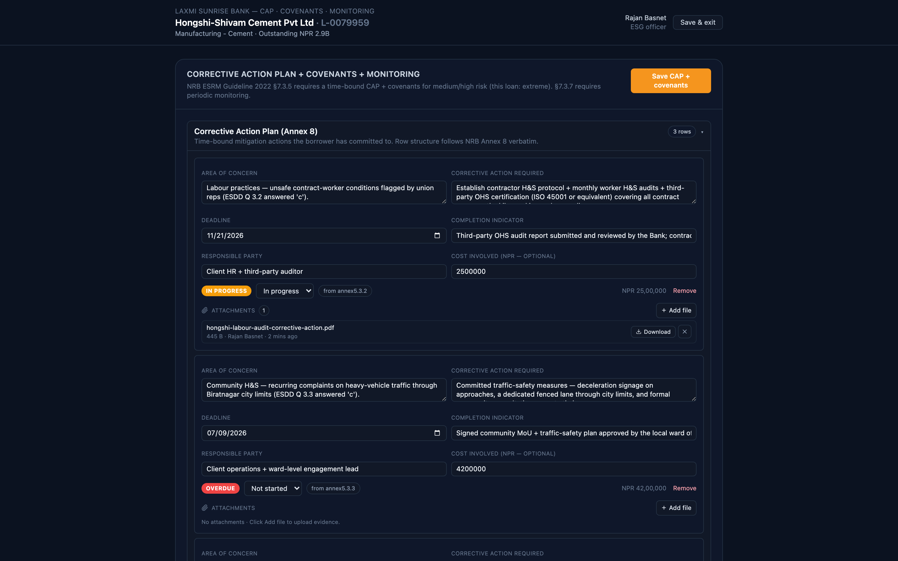
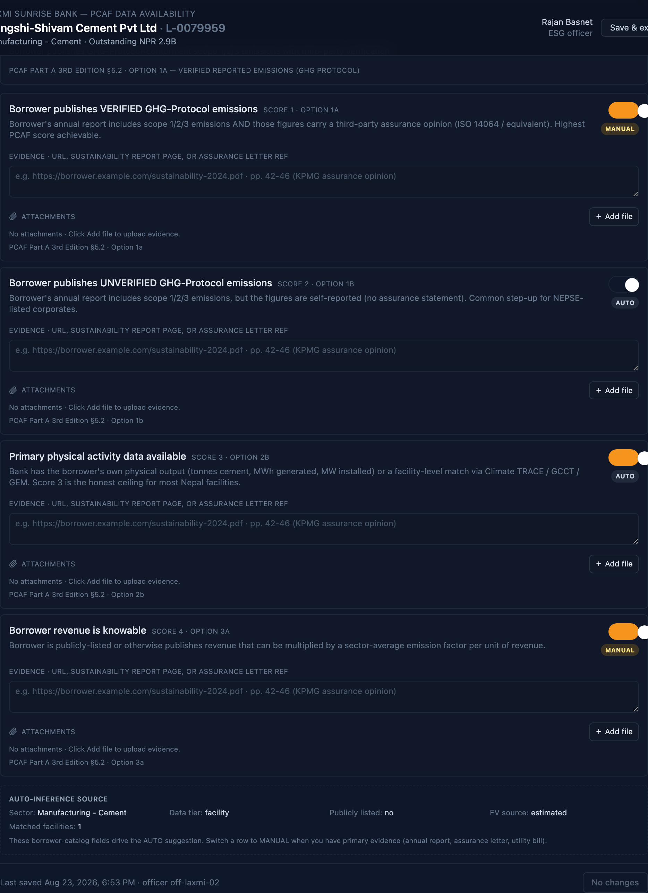
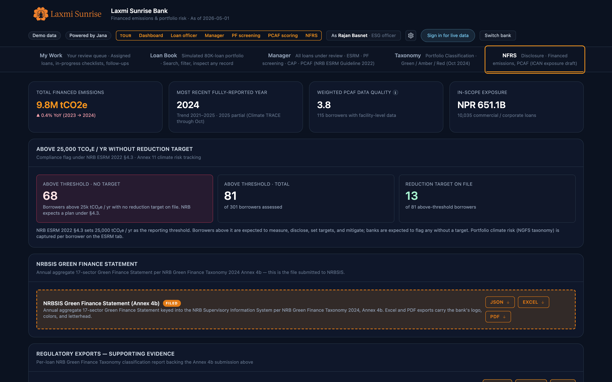
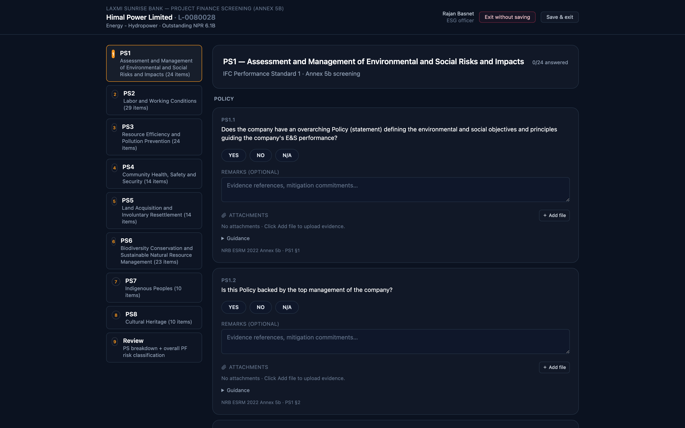
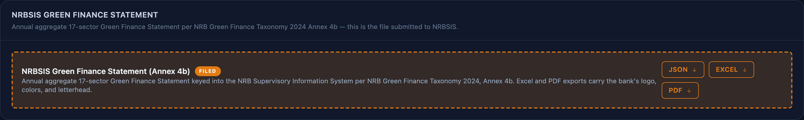

# Appendix A: Platform Screenshots

_Captured from the laxmi_sunrise tenant at 1600x1000, 2x scale._

**Figure 1.** My Work. The officer's personal queue, split into assigned loans and an available-to-claim pool, with follow-up items surfaced above.

**Figure 2.** Manager tab. Every commercial loan under review on one row, with the escalation banner and the portfolio-wide overdue corrective actions banner surfacing themselves above the queue.

**Figure 3.** Per-loan workbench. The compliance stripe reads the loan in three seconds; the sub-tabs below hold every obligation attached to it.

**Figure 4.** ESDD wizard. NRB Annex 5 transcribed word for word, with the four NRB answer options, guidance notes, remarks, and evidence attachment on every question.

**Figure 5.** Green Finance Taxonomy wizard. Activity selection from the NRB 2024 catalogue, with suggestions driven by the borrower's sector.

**Figure 6.** Corrective actions, covenants, and monitoring. Time-bound items under the 2022 Guideline section 7.3.5, with periodic monitoring under 7.3.7.

**Figure 7.** PCAF data availability. Four flag rows on the PCAF option ladder, auto-suggested from the borrower record and confirmed by the officer with evidence.

**Figure 8.** NFRS disclosure surface. Headline financed emissions, the NRBSIS Annex 4b return generated in one click, and the PCAF data quality distribution that defends the number.

**Figure 9.** Annex 5b project finance screening. Applies to project-finance loans only; items are mapped to the eight IFC Performance Standards.

**Figure 10.** The NRBSIS Green Finance Statement panel. One click produces the Annex 4b return as bank-branded Excel, PDF, or JSON.

